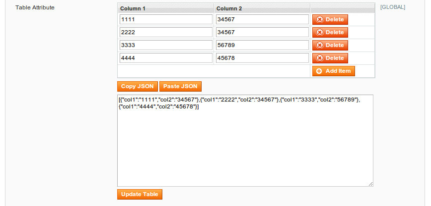

Aligent Custom Form Elements Extension
======================================

Facts
-----
- version: 0.0.1
- extension key: Aligent_CustomFormElements

Description
-----------
This extension provides customised form fields that can be used for EAV attributes.

Usage
-----

### Multi Column Table Attribute

This control wraps and extends the Mage_Adminhtml_Block_System_Config_Form_Field_Array_Abstract
field renderer available for System Configuration values and makes it available
for product and category attributes.  The data is stored in a text field in the
database serialized as JSON, and the UI has been extended to (optionally) allow
the table to be copied/pasted as a JSON blob.



You'll need to create an extension with a block that defines the columns that 
you want to appear in your table.  The code used to create the table seen above 
is as follows:
```
<?php

class Namespace_Extension_Block_Adminhtml_Catalog_Product_TableExample
    extends Aligent_CustomFormElements_Block_Array {

    public function __construct($attributes) {
        parent::__construct($attributes);
        $this->addColumn('col1', array(
            'label' => Mage::helper('namespace_extenstion')->__('Column 1'),
        ));
        $this->addColumn('col2', array(
            'label' => Mage::helper('namespace_extenstion')->__('Column 2'),
        ));
        $this->setAddAfter(false);
        $this->setAddButtonLabel(Mage::helper('namespace_extenstion')->__('Add Item'));
        $this->setCanCopyPasteJson(true);
    }

}
```
You can add as many columns as you like with additional `addColumn` calls.

The setCanCopyPasteJson call is used to enable the "Copy JSON" and "Paste JSON" 
functionality seen in the image above.  This allows the contents of the table to 
be copied to the clipboard as a JSON object.  The current contents of the table 
can be replaced by pasting JSON into the text area below (which is hidden until 
the user clicks "Paste JSON").  The copy/paste JSON functionality allows the 
table to be duplicated across many products quickly.

The other important aspect to making this work is the configuration of the attribute
itself.  The backend model, and the input renderer both need to be set correctly 
on the attribute.  The following setup script creates an attribute called 
"table_demo" (with the correct settings) and adds it to the "General" group in 
all attribute sets.

```
<?php
$setup = new Mage_Catalog_Model_Resource_Setup('core_setup');

$attr = array (
    'attribute_model' => NULL,
    'backend' => 'aligent_customformelements/entity_attribute_backend_serialized_json',
    'type' => 'text',
    'table' => NULL,
    'frontend' => NULL,
    'input' => 'text',
    'label' => 'Table Attribute',
    'frontend_class' => NULL,
    'required' => '0',
    'user_defined' => '1',
    'default' => '',
    'unique' => '0',
    'note' => NULL,
    'input_renderer' => 'namespace_extension/adminhtml_catalog_product_tableExample',
    'global' => '1',
    'visible' => '1',
    'searchable' => '0',
    'filterable' => '0',
    'comparable' => '0',
    'visible_on_front' => '1',
    'is_html_allowed_on_front' => '0',
    'is_used_for_price_rules' => '0',
    'filterable_in_search' => '0',
    'used_in_product_listing' => '1',
    'used_for_sort_by' => '0',
    'is_configurable' => '0',
    'apply_to' => '',
    'visible_in_advanced_search' => '0',
    'position' => '0',
    'wysiwyg_enabled' => '0',
    'used_for_promo_rules' => '0',
);
$setup->addAttribute('catalog_product', 'table_demo', $attr);

$aAttributeSetIds = $setup->getAllAttributeSetIds('catalog_product');

foreach ($aAttributeSetIds as $iAttributeSetId) {
    try {
        $attributeGroupId = $setup->getAttributeGroupId('catalog_product', $iAttributeSetId, 'General');
    } catch (Exception $e) {
        $attributeGroupId = $setup->getDefaultAttributeGroupId('catalog_product', $iAttributeSetId);
    }
    $setup->addAttributeToSet('catalog_product', $iAttributeSetId, $attributeGroupId, 'table_demo', 1001);
}
```

Installation Instructions
-------------------------
1. Install this module via modman or Composer

Uninstallation
--------------
1. Delete .modman/Magento-CustomFormElements and run "modman repair", or remove from
composer.json and run "composer install".

Support
-------
If you have any issues with this extension, open an issue on [GitHub](https://github.com/aligent/Aligent_CustomFormElements/issues).

Contribution
------------
Any contribution is highly appreciated. The best way to contribute code is to open a [pull request on GitHub](https://help.github.com/articles/using-pull-requests).

Developer
---------
Jim O'Halloran <jim@aligent.com.au>

Licence
-------
[OSL - Open Software Licence 3.0](http://opensource.org/licenses/osl-3.0.php)

Copyright
---------
(c) 2014 Aligent Consulting
